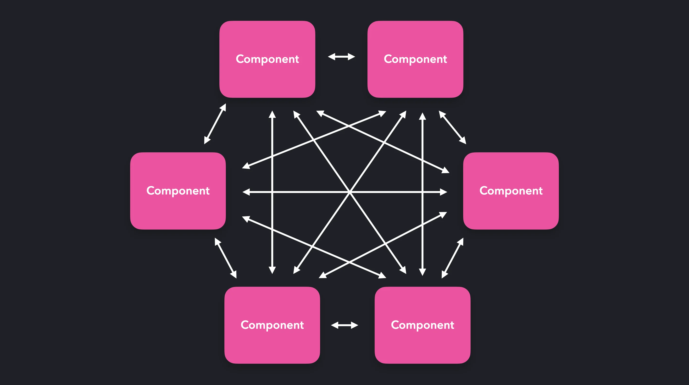
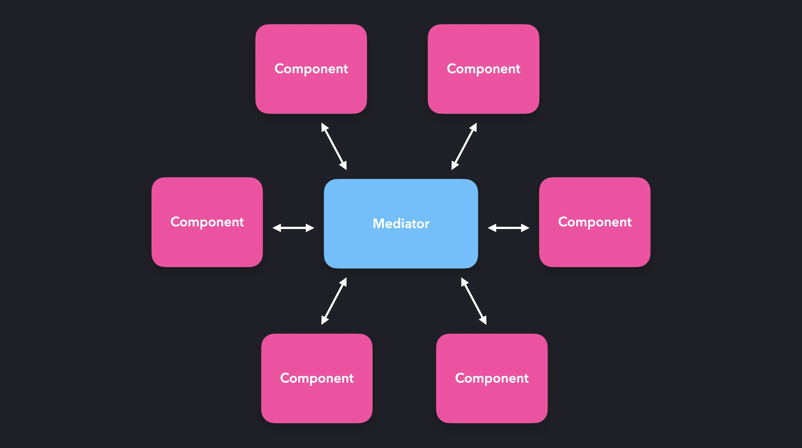
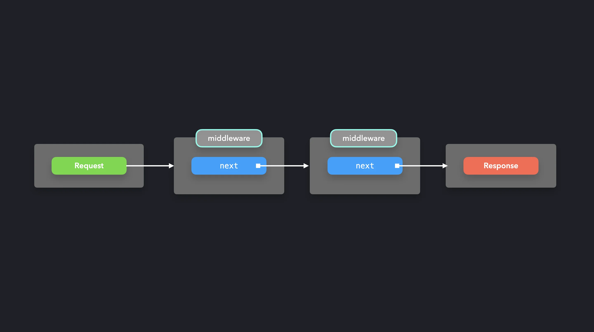

#### Design Pattern

# Mediator/Middleware Pattern

The mediator pattern makes it possible for components to interact with each other through a central point: the mediator. Instead of directly talking to each other, the mediator receives the requests, and sends them forward! In JavaScript, the mediator is often nothing more than an object literal or a function.

You can compare this pattern to the relationship between an air traffic controller and a pilot. Instead of having the pilots talk to each other directly, which would probably end up being quite chaotic, the pilots talk the air traffic controller. The air traffic controller makes sure that all planes receive the information they need in order to fly safely, without hitting the other airplanes.

Although we’re hopefully not controlling airplanes in JavaScript, we often have to deal with multidirectional data between objects. The communication between the components can get rather confusing if there is a large number of components.

<br>


<br>
Instead of letting every objects talk directly to the other objects, resulting in a many-to-many relationship, the object’s requests get handled by the mediator. The mediator processes this request, and sends it forward to where it needs to be.

<br>


<br>
A good use case for the mediator pattern is a chatroom! The users within the chatroom won’t talk to each other directly. Instead, the chatroom serves as the mediator between the users.
<br>

```javascript
class ChatRoom {
  logMessage(user, message) {
    const time = new Date();
    const sender = user.getName();

    console.log(`${time} [${sender}]: ${message}`);
  }
}

class User {
  constructor(name, chatroom) {
    this.name = name;
    this.chatroom = chatroom;
  }

  getName() {
    return this.name;
  }

  send(message) {
    this.chatroom.logMessage(this, message);
  }
}
```

<br>

We can create new users that are connected to the chat room. Each user instance has a **`send`** method which we can use in order to send messages.

```javascript
class ChatRoom {
  logMessage(user, message) {
    const sender = user.getName();
    console.log(`${new Date().toLocaleString()} [${sender}]: ${message}`);
  }
}

class User {
  constructor(name, chatroom) {
    this.name = name;
    this.chatroom = chatroom;
  }

  getName() {
    return this.name;
  }

  send(message) {
    this.chatroom.logMessage(this, message);
  }
}

const chatroom = new ChatRoom();

const user1 = new User("John Doe", chatroom);
const user2 = new User("Jane Doe", chatroom);

user1.send("Hi there!");
user2.send("Hey!");
```

<hr>

## Case Study

[Express.js](https://expressjs.com/) is a popular web application server framework. We can add callbacks to certain routes that the user can access.

Say we want add a header to the request if the user hits the root **`'/'`**. We can add this header in a middleware callback.

```javascript
const app = require("express")();

app.use("/", (req, res, next) => {
  req.headers["test-header"] = 1234;
  next();
});
```

The **`next`** method calls the next callback in the request-response cycle. We’d effectively be creating a chain of middleware functions that sit between the request and the response, or vice versa.

<br>


<br>
Let’s add another middleware function that checks whether the **`test-header`** was added correctly. The change added by the previous middleware function will be visible throughout the chain.

```javascript
const app = require("express")();

app.use(
  "/",
  (req, res, next) => {
    req.headers["test-header"] = 1234;
    next();
  },
  (req, res, next) => {
    console.log(`Request has test header: ${!!req.headers["test-header"]}`);
    next();
  }
);
```

Perfect! We can track and modify the request object all the way to the response through one or multiple middleware functions.

```javascript
const app = require("express")();
  const html = require("./data");

  app.use(
    "/",
    (req, res, next) => {
      req.headers["test-header"] = 1234;
      next();
    },
    (req, res, next) => {
      console.log(`Request has test header: ${!!req.headers["test-header"]}`);
      next();
    }
  );

  app.get("/", (req, res) => {
    res.set("Content-Type", "text/html");
    res.send(Buffer.from(html));
  });

  app.listen(8080, function() {
    console.log("Server is running on 8080");
  });
```

Every time the user hits a root endpoint **`'/'`**, the two middleware callbacks will be invoked.

<hr>

The middleware pattern makes it easy for us to simplify many-to-many relationships between objects, by letting all communication flow through one central point.

<hr>

**References:**
- [Docs - Express](https://expressjs.com/)
- [Mediator Pattern - OO Design](https://www.oodesign.com/mediator-pattern.html)